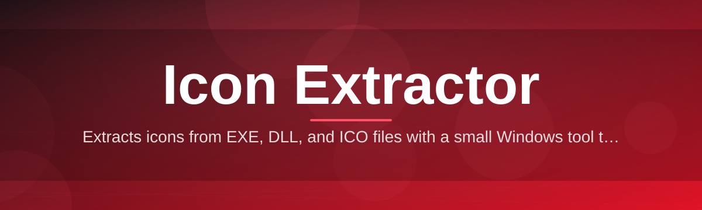

# icon-extractor-tool

Extracts icons from EXE, DLL, and ICO files with a small Windows tool that does it right

  

## Overview

Extracts icons from EXE, DLL, and ICO files with a small Windows tool that does it right

## License

[MIT License](LICENSE)
